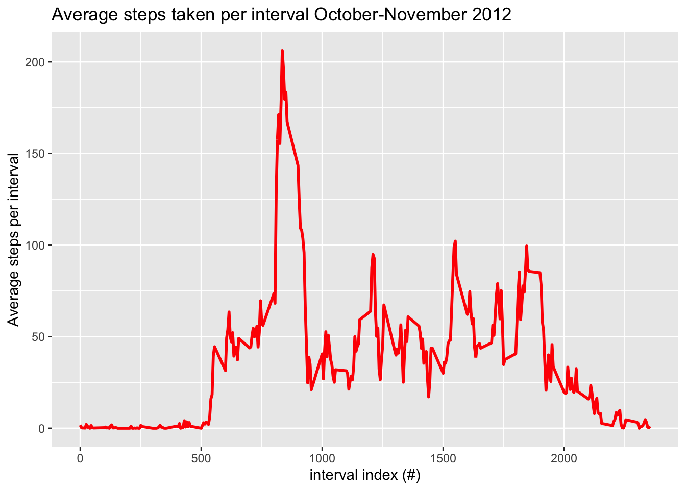
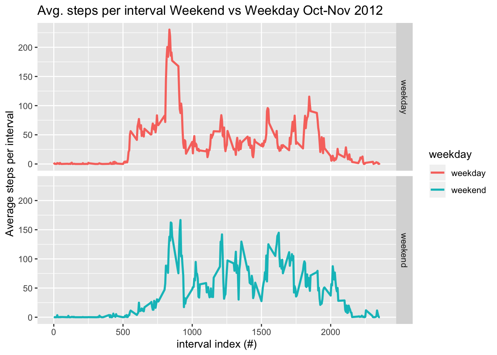

Reproducible Research: Peer Assessment1
=======================================
________________________________________

## Loading and preprocessing the data

___________________________________
1. load necessary packages


```r
library(lubridate)
library(dplyr)
library(ggplot2)
library(knitr)
library(kableExtra)
opts_chunk$set(fig.path = "./figure/")
```

2. import activity.csv and data frame formatting


```r
#import .csv file into R
unzip("repdata_data_activity.zip")
activity <- read.csv("activity.csv", header=TRUE, sep=",")
#format data frame for analysis 
activity$date <- ymd(activity$date)
activity$steps <- as.numeric(activity$steps)
```
__________________________________________________

## What is mean total number of steps taken per day?

__________________________________________________
*ignored missing values in dataset*

1. Make a histogram of the total number of steps taken each day


```r
#calculate step sum of each day
sumSteps <- activity %>% group_by(date) %>% summarize(tSteps=sum(steps))
#histogram on step sum
hist(sumSteps$tSteps, breaks=50, main="Total daily step count frequency October-November 2012", xlab="Total daily steps")
```


2. Calculate and report the **mean** and **median** total number of steps taken per day 


```r
#mean & median calculation 
mmStep <- cbind(Mean=mean(sumSteps$tSteps, na.rm=T), Median=median(sumSteps$tSteps, na.rm=T) )
#results printed in table 
kable(mmStep) %>% kable_styling(bootstrap_options="striped", full_width=F, position="left")
```

<table class="table table-striped" style="width: auto !important; ">
 <thead>
  <tr>
   <th style="text-align:right;"> Mean </th>
   <th style="text-align:right;"> Median </th>
  </tr>
 </thead>
<tbody>
  <tr>
   <td style="text-align:right;"> 10766.19 </td>
   <td style="text-align:right;"> 10765 </td>
  </tr>
</tbody>
</table>

____________________________________________

## What is the average daily activity pattern?

____________________________________________

1. Make a time series plot of the 5-minute interval (x-axis) and the average number of steps taken, averaged across all days (y-axis)


```r
#calculate average number of steps per interval 
mInterval <- activity %>% group_by(interval) %>% summarize(mStep=mean(steps, na.rm=T))
#time series plot of 5-min interval vs average steps taken
g <- ggplot(mInterval, aes(interval, mStep))
gInterval <-g + geom_line(color="red", size=1) + labs(y="Average steps per interval", x="interval index (#)", title="Average steps taken per interval October-November 2012")
print(gInterval)
```



2. Which 5-minute interval, on average across all the days in the dataset, contains the maximum number of steps?


```r
#subset row with maximum step number with corresponding 5-min interval
maxInterval <- mInterval[mInterval$mStep == max(mInterval$mStep), ]
```


The 5-min interval with the maximum number of steps (206.1698113) is **835**.

_________________________

## Imputting missing values

_________________________

1. Calculate and report the total number of missing values in the dataset


```r
#NA count calculation
NAs <- sum(is.na(activity$steps))
```

The total number of missing values is **2304**. 

2. Devise a strategy for filling in all the missing values in the dataset. It doesn't need to be sophisticated. For example, mean/median of the day or mean of the 5-min interval can be used, etc. 


```r
activity %>% mutate(steps=ifelse(is.na(steps), mInterval$mStep, steps))
```

3. Create a new dataset that is equal to the original dataset but with the missing data filled in. 


```r
#create new dataframe with missing data filled in 
activity2 <- activity %>% mutate(steps=ifelse(is.na(steps), mInterval$mStep, steps))
```

4. Make a histogram of the total number of steps taken each day and calculate/report the **mean** and **median** total number of steps taken per day. Do these values differe from the estimates from the first part of the assignment? What is the impact of imputing missing data on the estimates of the total daily number of steps? 


```r
#calculate total # of steps taken per day with NAs filled 
sumSteps2 <- activity2 %>% group_by(date) %>% summarize(tSteps=sum(steps))
#make histogram
hist(sumSteps2$tSteps, breaks=50, main="Total daily step count frequency October-November 2012", xlab="Total daily steps w/o NAs")
```


```r
#calculate mean & median w/ & w/o NAs
sumStepsMean <- mean(sumSteps$tSteps, na.rm=T)
sumStepsMedian <- median(sumSteps$tSteps, na.rm=T)
sumStepsMean2 <- mean(sumSteps2$tSteps)
sumStepsMedian2 <- median(sumSteps2$tSteps)
#create and report table of values 
mmSteps2 <- cbind(c("w/NAs", "w/o NAs"), Means=c(sumStepsMean, sumStepsMean2), Medians=c(sumStepsMedian, sumStepsMedian2))
kable(mmSteps2) %>% kable_styling(bootstrap_options="striped", full_width=F, position="left")
```

<table class="table table-striped" style="width: auto !important; ">
 <thead>
  <tr>
   <th style="text-align:left;">  </th>
   <th style="text-align:left;"> Means </th>
   <th style="text-align:left;"> Medians </th>
  </tr>
 </thead>
<tbody>
  <tr>
   <td style="text-align:left;"> w/NAs </td>
   <td style="text-align:left;"> 10766.1886792453 </td>
   <td style="text-align:left;"> 10765 </td>
  </tr>
  <tr>
   <td style="text-align:left;"> w/o NAs </td>
   <td style="text-align:left;"> 10766.1886792453 </td>
   <td style="text-align:left;"> 10766.1886792453 </td>
  </tr>
</tbody>
</table>

**According to the table above, there is no drastic impact on mean or median when comparing mean and median with NAs vs. filling in NAs.**

_________________________________________________________________________

## Are there differences in activity patterns between weekdays and weekends?

_________________________________________________________________________

1. Create a new factor variable in the dataset with two levels -- "weekday" and "weekend" indicating whether a given date is a weekday or weekend day. 


```r
#copy dataframe with a new variable indicating weekday for each observation
activity3 <- activity2 %>% select(steps, date, interval) %>% mutate(weekday=weekdays(date, abbreviate=TRUE))
#change weekday characters strings to either weekend or weekday and classify them as factors
activity3$weekday <- gsub("Sat|Sun", "weekend", activity3$weekday)
activity3$weekday <- gsub("Mon|Tue|Wed|Thu|Fri", "weekday", activity3$weekday)
activity3$weekday <- factor(activity3$weekday, levels=c("weekday", "weekend"))
```

2. Make a panel plot containing a time series plot of the 5-minute inteval (x-axis) and the average number of steps taken, averaged across all weekdays and weekends (y-axis). 


```r
#calculate average step per interval across all weekdays
mInterval2 <- activity3 %>% group_by(weekday, interval) %>% summarize(mStep=mean(steps))
#time series plot with seperate weekday and weekend panel
g1 <- ggplot(mInterval2, aes(interval, mStep))
gWsum <- g1 + geom_line(aes(color=weekday), size=1) + facet_grid(weekday~.) + labs(y="Average steps per interval", x="interval index (#)", title="Avg. steps per interval Weekend vs Weekday Oct-Nov 2012")
print(gWsum)
```



